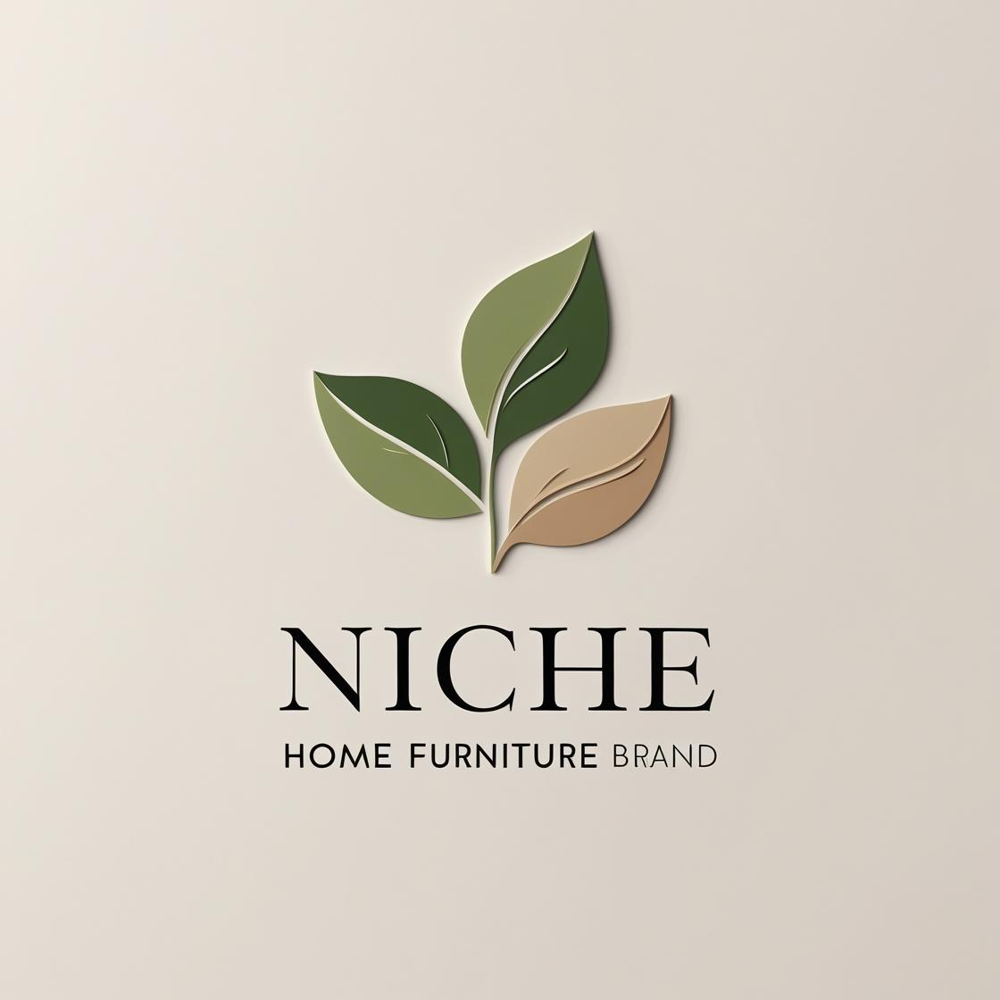

# 🪑 Niche - Furniture E-commerce App

**Niche** is a user-friendly furniture shopping app. The app allows users to explore curated collections of furniture, search and filter products by category, manage their cart, and securely place orders.

---

## 🚀 Features

### 🔒 User Authentication
- Signup & login using Firebase Authentication
- User sessions persist until logout

### 🏠 Home Screen
- Welcomes the user by name
- Search bar to find products
- Category images (Dining, Couch, Bed, Chairs, Cupboards, Lighting)
- Image scroll with dot indicators
- Product listing grid with rating, image, and price
- Cart icon with real-time badge count

### 🛍️ Product Browsing
- Products categorized by type (Dining, Couch, Bed, etc.)
- Filtered product display when category is selected
- Product details screen with "Add to Cart" button

### 🛒 Cart Management
- Add/remove products from cart
- Quantity management
- Total price calculation

### 📦 Order and Payment Flow
- View order history
- Simulated payment screen (future support for payment gateways)

### 👤 Profile Section
- View/edit username, email, password
- Change profile picture
- Navigate to Settings, Languages, Location
- Logout functionality

### 📍 Location Integration
- Access user location using Google Maps API
- Display nearby stores (for future enhancement)

---

## 🧪 Testing and Optimization

- Manual testing conducted on emulator and device
- Unit-tested Firebase read/write functionality
- Responsive layouts ensured for multiple screen sizes

---

## 🧩 Tech Stack

- **Language:** Java
- **UI/UX:** XML, Material Design
- **Backend:** Firebase Authentication, Realtime Database, Firebase Storage
- **Image Loading:** Glide
- **Location:** Google Maps API
- **Tools:** Android Studio, GitHub

---

## 📂 Folder Structure

```
Niche/
├── app/
│   ├── java/com/example/task2/
│   │   ├── activities/
│   │   ├── adapters/
│   │   ├── models/
│   │   ├── utils/
│   ├── res/
│   │   ├── layout/
│   │   ├── drawable/
│   │   ├── values/
│   ├── AndroidManifest.xml
├── README.md
```

---

## 📸 Logo



---

## 🙋‍♀️ Author

👤 Hasitha Kalla
📧 kallahasitha2023@gmail.com
🌐 www.linkedin.com/in/hasitha-kalla-949388359

---

## 📌 Notes

- This project was built as part of the **45-Day Android Development Challenge**.
- It demonstrates full-stack mobile app development using Firebase & Android.

